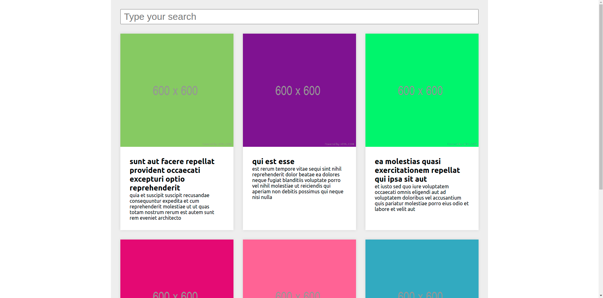
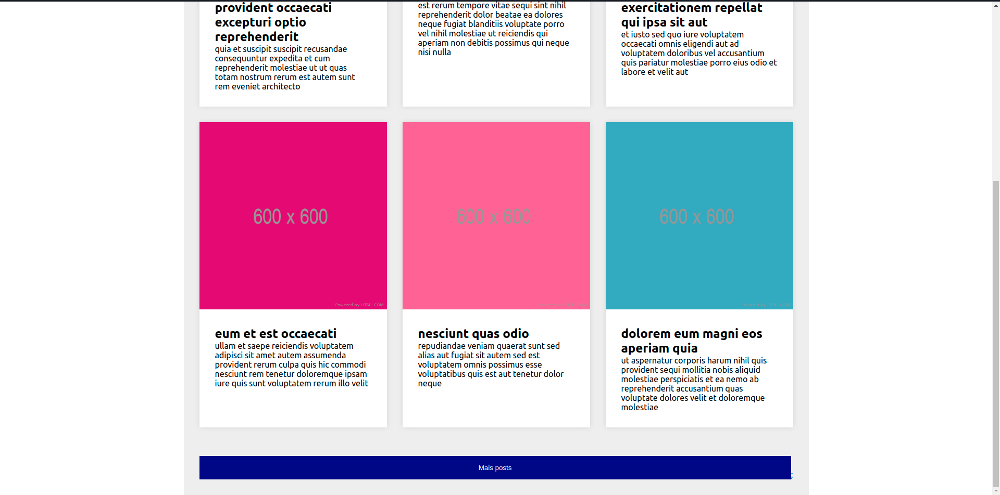
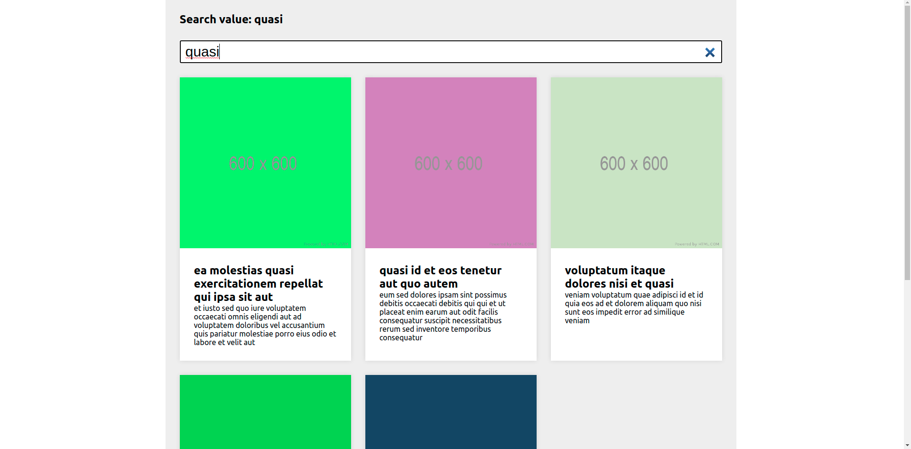
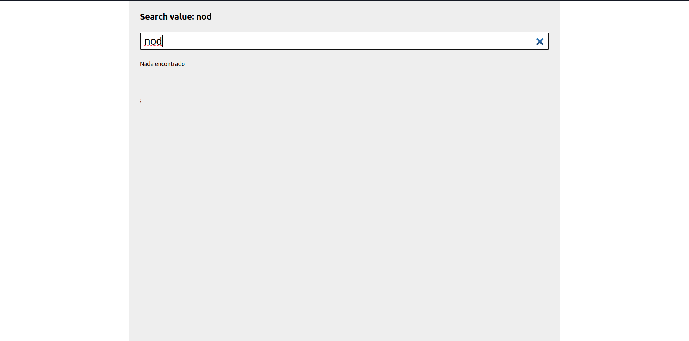

# Consumo de API com Rect.js

Projeto desenvolvido utilizando React.js. O intuido do projeto é colocar em prática meus estudo do react.js

## Projeto
Cosumuir uma API para exibição de cards com imagens, titulo e descrição vindo direto da API, e sendo renderizados com React.js. Também foi implemenatado uma de busca pelos cards, através do título e paginação com 6 cards sendo exbidos por página. Para isso neste projeto utilizei recursos como `fecth`, e gerencia de estados com os `hooks` do React. 

## Objetivos do projeto
O foco desde projeto não foi a estética do front-end e sim o consumo de uma API para exibição dos dados,recursos de busca, paginação e controle de estado com o React.js

## Tecnologias
- React.js
- JsonPlaceholder para consumo da API

## Configuração de ambiente e recursos necessários para inicializar o projeto
1. Clonar o repositório.
1. Executar o comando ` yarn i ` para insatalar as dependências necessárias.
1. Usar o comando `yarn start` para executar o projeto ` http://localhost:3000`

## Imagens do projeto

### Paginação

  

 

  

### Busca

  

 

  
